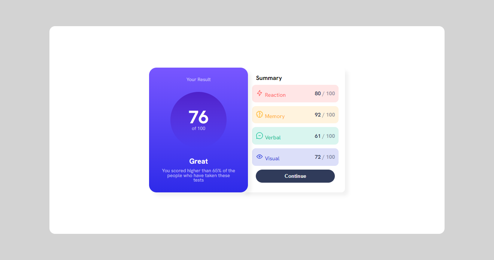

# Frontend Mentor - Results summary component solution

This is a solution to the [Results summary component challenge on Frontend Mentor](https://www.frontendmentor.io/challenges/results-summary-component-CE_K6s0maV). Frontend Mentor challenges help you improve your coding skills by building realistic projects. 

## Table of contents

- [Overview](#overview)
  - [Screenshot](#screenshot)
  - [Links](#links)
- [My process](#my-process)
  - [Built with](#built-with)
  - [What I learned](#what-i-learned)
  - [Continued development](#continued-development)
  - [Useful resources](#useful-resources)
- [Author](#author)

## Overview

### Screenshot



### Links

- Solution URL: [https://github.com/ThyagoHolanda/results-summary-component-main](https://github.com/ThyagoHolanda/results-summary-component-main)
- Live Site URL: [https://thyagoholanda.github.io/results-summary-component-main](https://thyagoholanda.github.io/results-summary-component-main)

## My process

### Built with

- Semantic HTML5 markup
- CSS custom properties
- Flexbox
- Mobile-first workflow
- [Styled Components](https://styled-components.com/) - For styles

### What I learned

I'm learning about mobile first and Media Queries

```css
@media (min-width: 1000px) {
    main {
        background-color: lightgray;
    }

    main .flex-container {
        flex-direction: row;
        width: 80vw;
        height: 80vh;
        border-radius: 15px;
    }
}
```
### Continued development

Continuarei estudando e praticando Mobile First.

### Useful resources

- [Developer Mozilla](https://developer.mozilla.org/pt-BR/) - I use it a lot to clear doubts or remember concepts.
- [W3schools](https://www.w3schools.com) - I also highly recommend W3Schools.]

## Author

- Website - [Thyago Holanda Monteiro de Lima](https://thyagoholanda.github.io)
- Frontend Mentor - [ThyagoHolanda](https://www.frontendmentor.io/profile/ThyagoHolanda)
- Linkedin - [Thyago Holanda Monteiro de Lima](https://www.linkedin.com/in/thyago-holanda-monteiro-de-lima/)